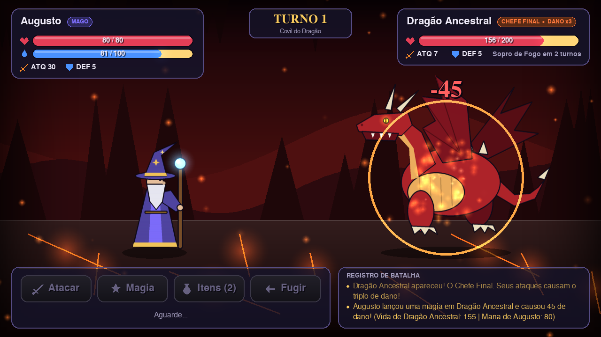
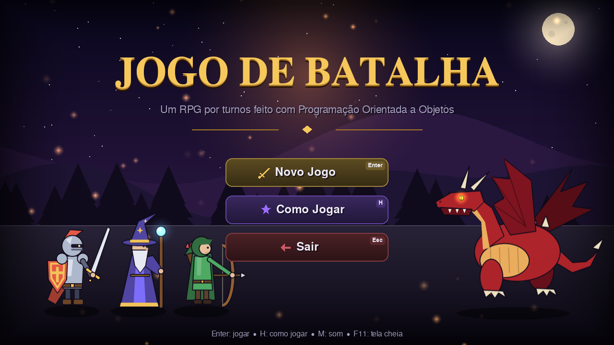
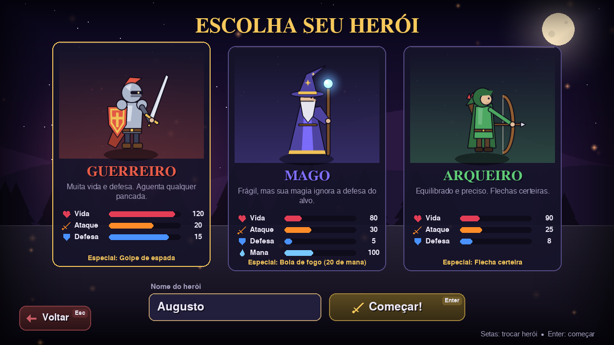
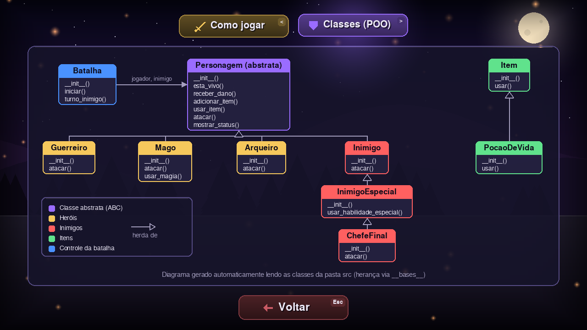

# ⚔️ Jogo de Batalha

Projeto desenvolvido na disciplina de Programação Orientada a Objetos.



## Executando o projeto

Na raiz do projeto, instale as dependências e abra a interface gráfica:

```bash
pip install -r requirements.txt
python jogar.py
```

(também funciona com `python -m interface`)

Para rodar os testes:

```bash
PYTHONPATH=. pytest
```

## 🎮 Interface gráfica

A interface foi feita com [pygame-ce](https://pyga.me/) e **não altera as regras do jogo**: todo o
combate continua sendo feito pelas classes da pasta `src` (`Guerreiro.atacar`, `Mago.usar_magia`,
`Batalha.turno_inimigo`, `PocaoDeVida.usar`...). As mensagens que essas classes escrevem com `print`
aparecem no registro de batalha da tela.

| Menu | Escolha do herói |
| --- | --- |
|  |  |

**O que tem na interface**

- Menu animado, tela de "Como jogar" e um **diagrama de classes gerado automaticamente** a partir
  das classes de `src` (usa `__bases__` e `inspect`).
- Escolha entre Guerreiro, Mago e Arqueiro, com os atributos lidos dos próprios objetos.
- Campanha com 3 fases: Goblin (`Inimigo`), Orc (`InimigoEspecial`) e Dragão (`ChefeFinal`).
- Animações de ataque, flechas, bola de fogo, sopro de fogo, números de dano, barras de vida
  animadas, tremor de tela, partículas e sons sintetizados (sem arquivos externos).
- Atalhos: `1` Atacar, `2` Magia, `3` Itens, `4` Fugir, `M` liga/desliga o som, `F11` tela cheia.



**Organização do código da interface** (pasta `interface/`)

| Arquivo | Responsabilidade |
| --- | --- |
| `logica.py` | `ControladorBatalha` e `Campanha`: organizam os turnos usando as classes de `src` (sem pygame, testado em `tests/test_interface_logica.py`) |
| `jogo.py` | `Jogo`: janela, loop principal e transição entre cenas |
| `cenas/` | Uma classe por tela, todas herdando da classe abstrata `Cena` |
| `sprites.py` | Personagens desenhados por código e suas animações |
| `componentes.py` | `Botao`, `BarraStatus`, `PainelLog`, `CampoTexto` |
| `efeitos.py` | Partículas, projéteis, textos flutuantes e tremor de tela |
| `cenario.py` | Cenários de fundo (floresta, fortaleza e covil do dragão) |
| `recursos.py` | Fontes e efeitos sonoros |

## Fluxo de desenvolvimento

Cada funcionalidade deve ser desenvolvida em uma branch própria.

Exemplo:

feature/ataque-guerreiro

Depois:

```bash
git add .
git commit -m "feat: implementa ataque do guerreiro"
git push
```

Após o push, abra um Pull Request no GitHub.

Regras:
- Não desenvolver diretamente na branch main.
- Cada funcionalidade deve possuir uma issue.
- Cada issue deve ser desenvolvida em uma branch.
- O Pull Request deve ser revisado por outro aluno.
- O código deve passar pelos testes antes do merge.
